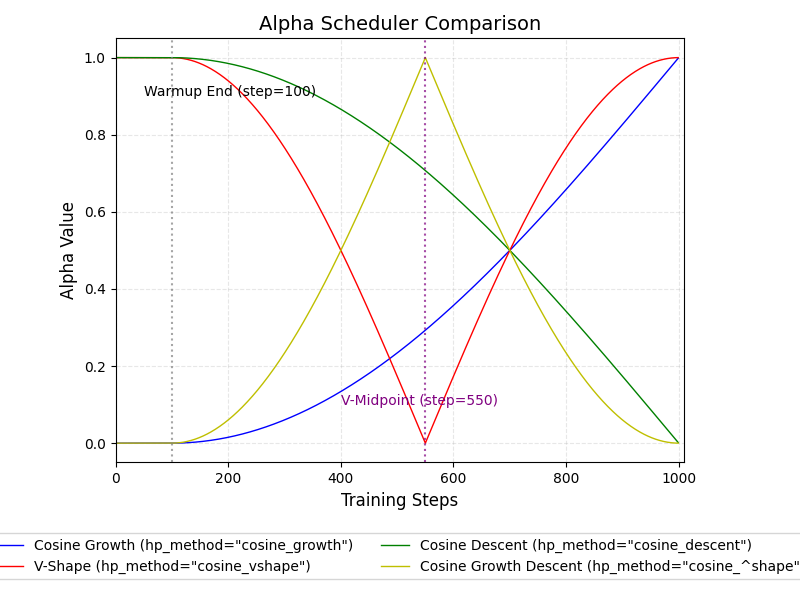

# Encoder Knowledge Distillation

本次实验中，所有分数均为最佳的5次评估的平均分。

实验环境：

GPU: RTX 3090 24GB

[实验日志](https://swanlab.cn/@lxxing666/Knowledge-Distillation/overview)

### 基线

$$
\mathcal{L}=\mathcal{L}_{ce}
$$

|        MODEL        | USE TEACHER WEIGHT INIT | SST-2 SCORE | IMDB SCORE |
| :-----------------: | :---------------------: | :---------: | :--------: |
| **DeBerta-v3-base** |            -            | **0.9587**  | **0.9608** |
|       Student       |           No            |   0.8266    |    0.87    |
|       Student       |           Yes           |   0.8853    |     -      |

参数降半后，模型的性能也大幅下降。从零开始训练的模型效果远低于教师模型，而使用教师权重初始化的学生模型收敛更快，效果也更好。

### 蒸馏

$$
\mathcal{L}=\alpha \mathcal{L}_{ce} + (1-\alpha) \mathcal{L}_{logits_{KL}}
$$

- 其中 $\alpha$ 固定为 0.5。

|    MODEL    | USE TEACHER WEIGHT INIT | SST-2 SCORE |
| :---------: | :---------------------: | :---------: |
|   Student   |           No            |   0.8342    |
| **Student** |         **Yes**         | **0.8931**  |

结果表明，使用教师模型权重初始化后的学生模型效果远比默认随机初始化的模型要好，

### 同时对齐多层特征表示

默认初始化的模型的蒸馏结果和直接训练该模型几乎没有提升，如果选择更多中间表征向教师对齐得到的结果是否会更好呢？

下面将对多层特征蒸馏：
$$
\mathcal{L}=\alpha \mathcal{L}_{ce} + (1-\alpha)(\mathcal{L}_{logits_{KL}}+\sum_{i\in \mathcal{A}} \mathcal{L}_{hidden_{MSE}}^i)
$$

- 其中 $\mathcal{A}$ 为选择的中间层索引集合。

- 使用 `MSE` 损失 对齐中间特征层。

  |  MODEL  | USE TEACHER WEIGHT INIT | SELECT LAYERS | SST-2 SCORE |
  | :-----: | :---------------------: | :-----------: | :---------: |
  | Student |         **Yes**         | [1,2,3,4,5,6] | **0.8929**  |
  | Student |           No            | [1,2,3,4,5,6] |   0.8383    |
  | Student |           No            |    [4,5,6]    |   0.8321    |
  | Student |           No            |    [1,2,3]    |   0.8362    |
  | Student |           No            |    [2,4,6]    |   0.8358    |
  | Student |           No            |    [1,3,5]    |   0.8358    |
  
  结果表明，在 SST-2 数据集上固定 $\alpha$ 对齐更多中间层**并未**带来明显优势，与仅对齐 `logits` 相当。
  

### 损失权重动态调度探索

为了能让学生再不同阶段更好地平衡自学与模仿教师，设计了四种 $\alpha$ 调度策略：

- **自学$\rightarrow$模仿教师**（`args.hp_method = cosine_descent`）

  初期学生更多依赖自己的 CE 损失，中后期逐渐增加对蒸馏损失的权重。

- **教师领路$\rightarrow$自己探索**（`args.hp_method = cosine_grwoth`）

  初期更依赖教师，中后期逐步放手，减少对教师的依赖。

- **自学$\rightarrow$老师指正$\rightarrow$自己探索**（`args.hp_method = cosine_vshape`）

  先自己学习，然后依赖教师，最后自主探索。

- **老师领路$\rightarrow$自己探索$\rightarrow$老师修正**（`args.hp_method = cosine_^shape`）

  开始依赖教师，中期自主探索，最后让教师再指导一轮。

#### 实验结果

|  MODEL  | USE TEACHER WEIGHT INIT | SELECT LAYERS | HP-METHOD | SST-2 SCORE |
| :-----: | :----------: | :---------: | :-----: | :-----: |
| Student |     No      |   [1,2,3]   |   `cosine-descent`   |   0.8312   |
| Student |     **No**     | [1,2,3] | **`cosine-growth`** | **0.8431** |
| Student | No | [1,2,3] | `cosine-vshape` | 0.8353 |
| Student | No | [1,2,3] | `cosine-^shape` | 0.8365 |
| Student | Yes | [1,2,3] | `cosine-descent` | 0.8174 |
| Student | **Yes** | [1,2,3] | **`cosine-growth`** | **0.8991** |
| Student | Yes | [1,2,3] | `cosine-vshape` | 0.8908 |
| Student | Yes | [1,2,3] | `cosine-^shape` | 0.8956 |

结果显示，在相同训练配置下，大多数情况下动态调度策略都优于固定 $\alpha$ 的模型；其中 **`cosine-growth`** 效果最明显，尤其是配合**随机**权重初始化时，性能提升接近 1 个百分点。
