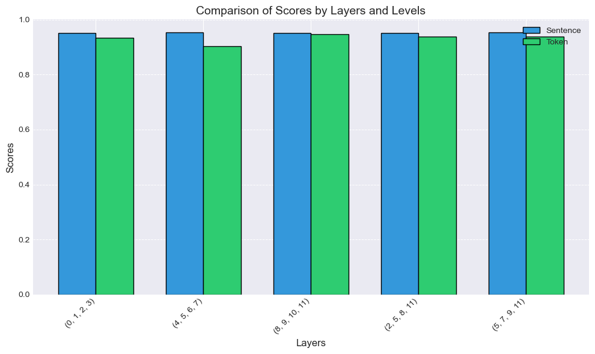

# 对比学习

通过拉近相似样本的表示、推开步相似样本的表示，在无监督/自监督场景下学习高质量的数据表征。这种方法尤其在数据标注稀缺的情况下显示出强大的性能。

## 基线模型训练

本实验以 **DeBERTa-V3-base** 为基准模型，采用参数微调策略，仅更新模型最后四层 Transformer 层及分类器权重。具体配置如下：

- 分类器初始学习率：$1 \times 10^{-4}$
- 编码器最后一层初始学习率：$2 \times 10^{-5}$，每向前一层衰减 5%
- 所有实验超参数配置一致，训练轮数为 3

结果如下所示：

|       Model        |    Score    |
| :----------------: | :---------: |
| $DeBERTa-V3-base$  |   0.94868   |
| $DeBERTa-V3-rdrop$ | **0.95056** |
|  $DeBERTa-V3-scl$  |   0.94884   |

​																																													  *实验环境：Tesla P100 16G*

结果表明，无论是采用对比学习（SCL），还是引入输出一致性约束（R-Drop），都能在一定程度上提升模型性能。

## SupConLoss稳定性优化

在 DeBERTa-V3-SCL 模型训练过程中，曾出现梯度爆炸现象。通过对 `[CLS]` 表征向量进行 L2 归一化，有效缓解了该问题，训练过程趋于稳定。

|                         Loss                         |                          Grad_Norm                           |
| :--------------------------------------------------: | :----------------------------------------------------------: |
|  |  |

## R-Drop 编码策略对比

为评估不同的编码策略对 R-Drop 效果的影响，我们比较了以下两种方式：

- **One-stage**：共享一次 Encoder 表征，使用不同的 Dropout mask 获取两个输出
- **Two-stage**：对输入执行两次独立的 Encoder 前向传播

|  Method   |    Score    |
| :-------: | :---------: |
| One-stage |   0.95044   |
| Two-stage | **0.95120** |

​																																													  *实验环境：Tesla P100 16G*

尽管 Two-stage 模式性能略高，但 One-stage 方法在显存使用和推理速度方面更具优势，且性能损失较小。因此，后续实验将优先采用 One-stage 方案。

## SCL视角增强

多视角增强

- R-Drop（one，One-stage）

- 从DeBERTa的不同中间层提取`[CLS]`表征

|                Method                 |    Score    |
| :-----------------------------------: | :---------: |
| SCL_MultiView(R-Drop,other layer cls) | **0.94736** |
|              SCL_OneView              |   0.94636   |

​																																													  *实验环境：Tesla P100 16G*

结果表示，使用多视角的 `SupConLoss` 损失具有一定优势，下面将讨论跟多视角的引入。

## Sentence-Level $\rightarrow$ Token-Level 细粒度对比学习

情感分类任务中，一些关键词（如“good”，“boring”）是影响判别的关键。当前`[CLS]`对比过于粗糙，无法捕捉到这些细节。

为了简单起见，**每个 sample 选择其`[CLS]`关注度最高的 $k$ 个 token， 将这 $k$ 个 token 看作一个 sample 的不同视角**，这样就能很容易的扩展多视角对比。与 SupConLoss 一样，一个 batch 中的同类为正样本，不同类为负样本。代码见`utils/func.select_topk_tokens`

随后我又实现了一个聚类的版本，使用 `K-Means` 聚类算法对每个 sample 的 $k$ 个token聚类。代码见`utils/func.cluster_views`

#### `Token-Level` 在 `IMDB` 的测试得分, 其中 $\alpha$ 为对比损失权重

| K \ $\alpha$ |   0.2   |   0.5   |
| :----------: | :-----: | :-----: |
|      30      | 0.95100 | 0.94972 |
|      60      | 0.95124 | 0.95068 |
|      90      | 0.95084 | 0.95080 |

​																																												      *实验环境：RTX 4090 24G*

*注：得分均在0.95以上，主要原因应该是我把序列最大长度设为510，以便能选更多token，还使用了Lora微调*

#### `Token-Level` `[CLS]` 表征t-SNE可视化 （训练集 20000 samples)

| K\\$\alpha$ |                             0.2                              |                             0.5                              |
| :---------: | :----------------------------------------------------------: | :----------------------------------------------------------: |
|     30      |  |  |
|     60      |  |  |
|     90      |  |  |

#### `Token-Level` `[CLS]` 表征评估 (训练集 20000 samples)

|          Model          | SVM Accuracy | 1-NN Accuracy |     ARI      |     NMI      |
| :---------------------: | :----------: | :-----------: | :----------: | :----------: |
|          lora           | **0.95025**  |    0.93015    | **0.815761** | **0.721010** |
|    lora_k30_alpha0.2    |   0.94890    |    0.92465    |   0.807832   |   0.712066   |
|    lora_k30_alpha0.5    |   0.94810    |    0.92380    |   0.803702   |   0.707661   |
|    lora_k60_alpha0.2    |   0.94840    |    0.92375    |   0.808371   |   0.713071   |
|    lora_k60_alpha0.5    |   0.94815    |    0.92340    |   0.807293   |   0.711029   |
|    lora_k90_alpha0.2    |   0.94825    |    0.92535    |   0.810891   |   0.715902   |
|    lora_k90_alpha0.5    |   0.94850    |    0.92365    |   0.808371   |   0.712198   |
| lora_k90_alpha0.25_nc5  |   0.94855    |    0.93115    |   0.812513   |   0.719907   |
| lora_k90_alpha0.25_nc10 |   0.94890    |  **0.93205**  |   0.812332   |   0.720072   |
| lora_k90_alpha0.25_nc15 |   0.94820    |    0.93045    |   0.812152   |   0.718854   |

​																																														*实验环境：RTX 4090 24G*

*注：线性可分性svm_accuracy: 使用线性SVM进行5折交叉验证的准确率*

​		*最近邻分类 (1nn_accuracy)*: 1-最近邻分类器的5折交叉验证准确率*

​		*聚类一致性 (ari): 调整兰德指数(Adjusted Rand Index)，比较聚类结果与真实标签的相似度*

​		*聚类一致性 (nmi)：标准化互信息(Normalized Mutual Information), 衡量聚类结果与真实标签的信息共享量*

忙活半天发现使用对比学习的结果并没有只用交叉熵损失好。:joy: 

## Last Layer Contrastic Learning $\rightarrow$ Multi-Layer Contrastic Learning 

许多中间层的信息在训练中并未被充分利用，通过多层次的对比学习，是否能更好利用中间层的有用信息呢？

现对DeBERTa使用分层对比损失，具体来说，如果选择的层为 layers = [7, 8, 9]，那么 `SCL` 损失由这3层贡献，每层的损失函数计算级别有以下两种：

- `token`：字符级对比损失
- `sentence`：句子级对比损失

代码实现见./imdb_deberta_multilayers_contrastic.py，训练脚本./multilayers_train.sh

#### 实验结果

结果表明，分层对比学习相较于传统对比学习效果并没有提升，甚至远远不如，token级别的对比学习相较于sentence级别亦是如此。

从`train/loss`曲线来看，使用分层对比学习的效果并没用传统的方法好。

#### 分层对比学习表征评估（验证集 5000 samples）

|       Model        | SVM Accuracy | 1-NN Accuracy |    ARI     |    NMI     |
| :----------------: | :----------: | :-----------: | :--------: | :--------: |
|  sentence_0_1_2_3  |    0.9180    |    0.9216     |   0.7835   |   0.6873   |
|  sentence_4_5_6_7  |    0.9232    |    0.9228     |   0.7857   |   0.6920   |
| sentence_8_9_10_11 |    0.9270    |    0.9232     |   0.7906   |   0.6915   |
| sentence_2_5_8_11  |    0.9220    |  **0.9286**   | **0.7942** | **0.6957** |
| sentence_5_7_9_11  |    0.9272    |    0.9254     |   0.7913   |   0.6923   |
|    sentence_11     |    0.9238    |    0.9152     |   0.7850   |   0.6868   |
|   token_0_1_2_3    |    0.9070    |    0.9032     |   0.7409   |   0.6466   |
|   token_4_5_6_7    |    0.8902    |    0.8586     |   0.6502   |   0.5418   |
|  token_8_9_10_11   |  **0.9358**  |    0.9156     |   0.7744   |   0.6734   |
|   token_2_5_8_11   |    0.9200    |    0.9080     |   0.7395   |   0.6344   |
|   token_5_7_9_11   |    0.9202    |    0.9020     |   0.7286   |   0.6238   |
|      token_11      |    0.9328    |    0.9250     |   0.7885   |   0.6889   |

​																																														   实验环境：RTX 3090 24G

#### t-SNE可视化对比 (验证集 5000 samples)

| sentence_2_5_8_11                                            | sentence_0_1_2_3                                             |                      sentence_8_9_10_11                      |
| ------------------------------------------------------------ | ------------------------------------------------------------ | :----------------------------------------------------------: |
|  |  |  |

结果表明，在编码器的靠后层使用分层对比学习效果由于在编码器的前层使用分层对比学习。
