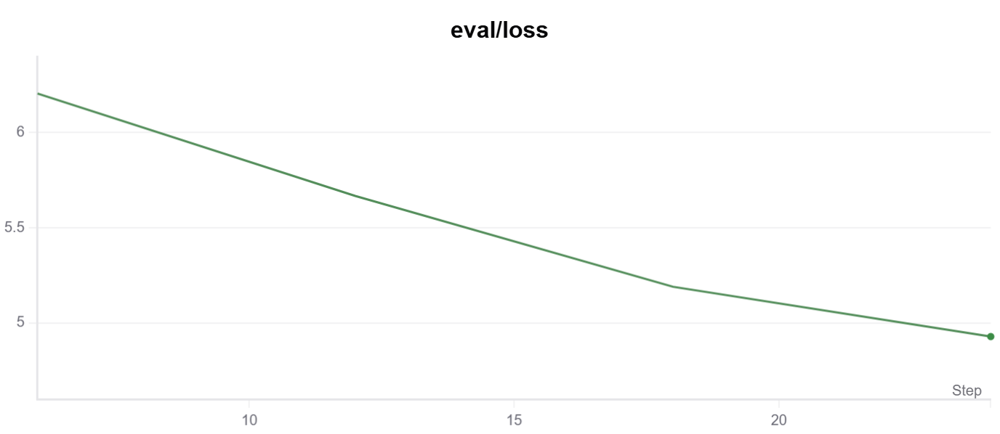

# Instruction Learning

本实验基于SST-2数据集，分别在`DeBERTa-v3-base`和多个生成式大模型上进行`LoRA`微调。实验未划分验证集，原验证集（1872个样本）直接作为测试集评估模型性能。

为缓解少样本带来的类别不平衡，采用均匀采样训练。

## DeBERTa-v3-base

为使少样本类别平衡，使用均匀采样训练DeBERTa.

| Samples | Epochs |    Acc     |
| :-----: | :----: | :--------: |
|   16    |   3    |   0.5091   |
|   64    |   3    |   0.5091   |
|   256   |   3    |   0.5091   |
|  1024   |   3    |   0.5091   |
| **All** |   3    | **0.9472** |
*实验环境： RTX 3090 24G*

可以看到，<mark>小样本微调几乎无法带来提升</mark>，测试集准确率长期停留在随机水平（约0.5）。分析发现，这可能与较大的batch size（128）有关：模型在训练初期快速收敛到单一类别，丧失了对特征的区分能力。

将batch size减小至4后（仅对较大样本量可行，因小样本时训练仍不稳定）：

| Samples | Epochs |  Acc   |
| :-----: | :----: | :----: |
|   16    |   3    | 0.5091 |
|   64    |   3    | 0.5091 |
|   256   |   3    | 0.6135 |
|  1024   |   3    | 0.8818 |
*实验环境： RTX 3090 24G*

结果表明：<mark>样本量在256及以上时显著提升</mark>，尤其1024时接近0.88。而16和64样本时仍无明显效果。可能是小样本情况下，分布差异大，难以捕捉有效特征？

## Generate Model

#### 预训练模型在测试集上的表现

|             Model             | Max_New_Tokens | Number of Not Following Instructions(outputs does not contain 0 or 1) |   Score    |
| :---------------------------: | :------------: | :----------------------------------------------------------: | :--------: |
|          Qwen3-0.6B           |     32768      |                              0                               |   0.8452   |
|         Qwen3-8B-INT4         |       10       |                              0                               |   0.9334   |
|         Qwen2.5-0.5B          |       10       |                             216                              |   0.4014   |
| **Qwen2.5-7B-Instruct-INT4**  |       10       |                              0                               | **0.9507** |
|          Gemma-3-1B           |       10       |                              0                               |  0.83601   |
| Meta-Llama-3-8B-Instruct-INT4 |       10       |                              0                               |   0.8956   |
*实验环境： RTX 3090 24G*

结果表明：

- 随着模型参数量增大，模型性能普遍提升。
- `Qwen2.5-7B-Instruct-INT4`已超过`DeBERTa-v3-base`的全样本微调结果。
- `Qwen2.5-0.5B`性能显著较低，主要因为模型在推理时未正确执行指令（未第一时间输出“0”或“1”）。

#### `Qwen2.5-0.5B`指令微调

尝试用LoRA微调提升指令遵循能力。使用不同样本量（16, 64, 256, 全部）进行实验：

- 使用1024及全部样本时出现过拟合：`Eval Loss`持续上升。
- 小样本微调时虽过拟合减轻，但模型泛化能力有限。

| Samples |                          Train/Loss                          |                          Eval/Loss                           |
| ------- | :----------------------------------------------------------: | :----------------------------------------------------------: |
| ALL     |  |  |
| 1024    |  |  |
| 256     |  |  |
| 64      |  |  |
| 16      |  |  |

#### 微调结果

|    Checkpoints     | Num Of Samples | Number of Not Following Instructions(outputs does not contain 0 or 1) |   Score    |
| :----------------: | :------------: | :----------------------------------------------------------: | :--------: |
| **checkpoint-end** |      ALL       |                              0                               | **0.7557** |
|    checkpoint-6    |       16       |                              0                               |   0.5608   |
|   checkpoint-24    |       64       |                              0                               |   0.5528   |
|   checkpoint-40    |      256       |                              0                               |   0.5275   |
*实验环境： RTX 3090 24G*

结果比较有意思：

- 使用<mark>全部训练数据</mark>时性能仍最优（0.7557），尽管`Eval Loss`上升。

- 小样本（16, 64, 256）反而随着样本量增加性能降低，与`DeBERTa`结果刚好相反。

对于生成模型，参数量才是决定零样本能力得关键？小模型即便指令微调也难以匹敌大模型。
